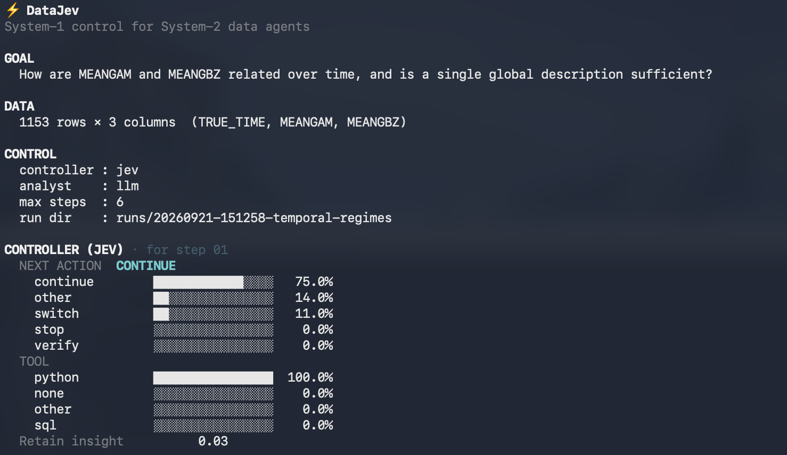
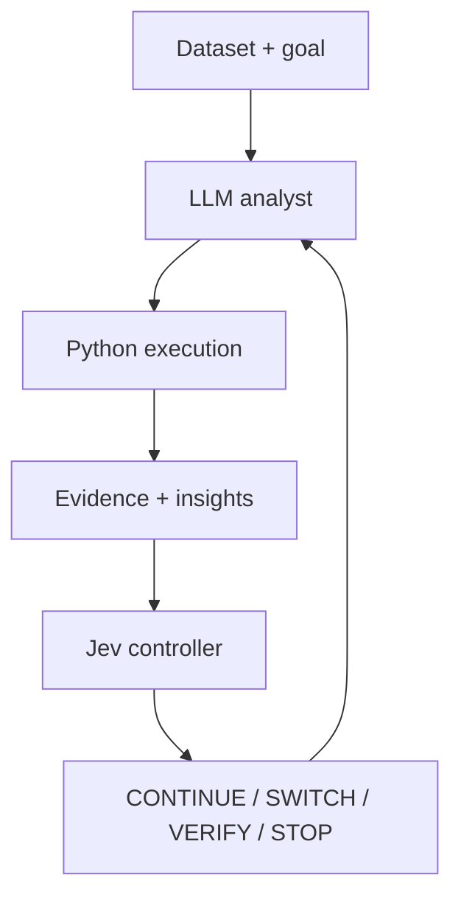

# ⚡ DataJev

**System-1 control for System-2 data agents.**

**Let LLMs analyze. Let Jev decide what to analyze next.**



Most data agents use a generative model both to perform analysis and to decide
whether to continue, change direction, verify a finding, or stop. DataJev
separates those roles:

- **LLM** decides how to perform an analytical step.
- **Python** executes the step and produces evidence.
- **Jev** controls the analytical trajectory.

> Your LLM doesn't need to think about whether it should keep thinking.



## Why DataJev

The analyst is good at writing code, reading results, and explaining evidence.
The controller is responsible for the next bounded decision. Jev sees a
compressed analytical state—goal, schema, recent results, retained insights,
and trajectory—not the raw CSV. This keeps analytical execution and trajectory
control as separate, inspectable parts of the loop.

## Quickstart

DataJev requires Python 3.12 and uses `uv` for the environment.

```bash
git clone https://github.com/zzz1YAO/DataJev.git
cd DataJev
uv sync
cp .env.example .env
```

Fill `.env` with a TypeSafe key and an OpenAI-compatible analyst configuration:

```env
TYPESAFE_API_KEY=...
DATAJEV_LLM_API_KEY=...
DATAJEV_LLM_BASE_URL=...
DATAJEV_LLM_MODEL=...
```

Then run the real controller and analyst:

```bash
uv run datajev analyze examples/temporal_regimes.csv \
  --goal "How are MEANGAM and MEANGBZ related over time, and is a single global description sufficient?" \
  --controller jev \
  --analyst llm
```

For a no-key local smoke test:

```bash
uv run datajev analyze examples/temporal_regimes.csv \
  --goal "How are MEANGAM and MEANGBZ related over time, and is a single global description sufficient?" \
  --controller heuristic \
  --analyst scripted
```

## How it works

Each loop iteration is bounded and inspectable:

1. The controller reads the compressed state and returns typed decisions.
2. The analyst writes one Python analysis step.
3. The executor runs it and records stdout, stderr, code, and artifacts.
4. The analyst interprets the evidence.
5. The controller chooses the next action or stops the run.

The analyst may use matplotlib or another Python library when a plot helps. A
plot is an analytical artifact, not a separate controller action.

## The Jev decisions

Jev does not calculate correlations, write Python, perform statistical analysis,
or replace the generative analyst. It controls the trajectory:

| Decision | Meaning |
| --- | --- |
| `CONTINUE` | Deepen the current analytical direction. |
| `SWITCH` | Explore a meaningfully different direction. |
| `VERIFY` | Stress-test or independently check an important finding. |
| `STOP` | Enough evidence has been collected to synthesize an answer. |

Each controller response also carries an insight-retention probability, a
verification probability, and an analysis-completeness score. They are recorded
alongside the action and its probability distribution.

## Real example

`examples/temporal_regimes.csv` is a small synthetic dataset designed to make a
temporal relationship easy to inspect. Its global relationship is strong, but
the relationship is not equally stable throughout the record.

A representative run can show the analyst finding the global relationship,
Jev requesting additional evidence before stopping, and the final answer
qualifying the global description with temporal analysis. Individual trajectories
can vary; DataJev does not require every run to take the same path.

The CSV can be regenerated with:

```bash
uv run python examples/make_temporal_regimes.py
```

## CLI, traces, and artifacts

The main command is:

```bash
uv run datajev analyze DATA.csv --goal "..."
```

To inspect a saved run:

```bash
uv run datajev show runs/<timestamp>-<name> --steps
```

Each run contains:

```text
trace.json          controller decisions, probabilities, steps, errors, and final answer
final_answer.md     the closing answer
steps/              exact generated Python and captured output
artifacts/          plots and other files produced by the steps
```

## Status and limitations

DataJev V0 is a backend and CLI vertical slice. It does not include a web UI,
multi-agent orchestration, SQL execution, persistent memory, or a sandbox for
untrusted generated code. Real Jev and LLM runs require API credentials. The
offline path is deterministic and intended for local smoke tests.

## Development

```bash
uv run pytest
uv run python examples/quickstart.py --offline
```

The project is not claiming benchmarked speedups or automatic answer-quality
improvements in this release.
